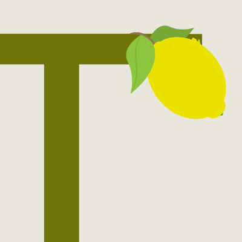

# Hey  I'm Alex 🇬🇧🇨🇦 
I'm a full stack developer with a passion for all things Typescript. I work alot with Node with Express, Koa & GraphQL using both relational and non-relational databases on the back-end, frequently using React on the front-end alongside styling frameworks Sass & Tailwind.

 😉 Hiring? 😉 I'm currently available for work based in South East U.K. & open to work remotely 💻, in the wider U.K. 🇬🇧 and Canada 🇨🇦.

📮 You can reach me at: alexanderjshall@gmail.com 

💬 Ask me about my experiments with Tone.js, using Typescript with React, or why I started as a beginner with C++ 😂

## Current Activities 

- ⌨️ **Developing** - Currently I am working on a polyrhythmic meditation app working with React Native, Electron w/ React & ToneJS.
- 🧰 **Learning** - Currently I am learning ***Microsoft Azure*** & ***React Native***

## Recent Projects 🎻

</img> **Remedic** (Full Stack Web App) -> A web app for providing a translation service for live medical consultations with a doctor & with improving healthcare services & understanding for ESL or non-english speakers in the UK.

</img> **TechLog** (Full Stack Web App) -> A utility application designed for logging usage & defections with common technologies used on off-shore oil-rigs. In a team of 2, I helped design a full suite of unit, integration & e2e tests.

</img> **Tuck** (Full Stack Web App) -> Designed to minimise food waste, tuck is recipe app that encourages users to add variations to standard recipes, enabling chefs to search by ingredient or popularity, without having to trawl through recipe blogs.

## My Technical Experience

**Programming Languages**

<code></code><code></code><code></code><code></code><code></code>

**Front-end technologies**

<code></code><code></code><code></code> 

**Back-end technologies**

**Testing Frameworks**

## About Me 👨🏻‍💻

Born in Canada and raised in the UK, I started learning programming with C++, however I ported my learning to Typescript (& by extension Javascript) as I found it balanced my fondness for the strong typing of C and the ability to make things happen! Originally training as a musician, I love to learn & create... so needless to say I love being a software developer.
